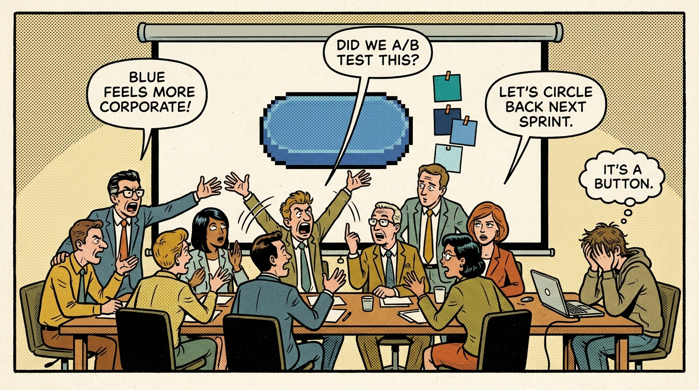
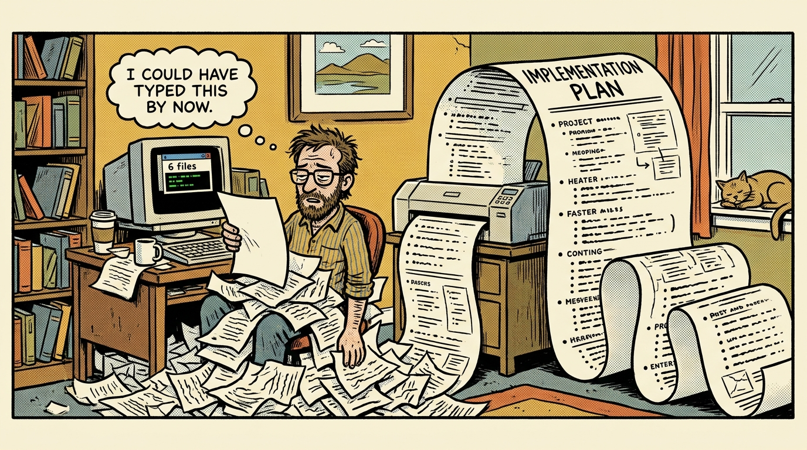

I am always looking to optimize my process. And to be honest, that behavior is exactly what leads me to AI workslop today.

The word is not mine. Researchers at BetterUp Labs and Stanford's Social Media Lab coined it in [Harvard Business Review](https://hbr.org/2025/09/ai-generated-workslop-is-destroying-productivity) in September 2025, for AI-generated work that looks polished but carries nothing that moves the task forward. Their survey found 40% of US desk workers had been handed some, and that each instance cost about two hours to repair.

I test a lot of plugins and skills. [RPI](https://github.com/shanraisshan/claude-code-best-practice/blob/main/development-workflows/rpi/rpi-workflow.md) workflows, [gstack](https://github.com/garrytan/gstack), Garry Tan's Claude Code setup, twenty-three skills that play CEO, designer, eng manager, QA lead and release engineer. I even built my own [`decision-ledger`](https://github.com/Dupflo/decision-ledger) skill. There are cases where none of it is productive, and cases where it actively adds complexity.

Rewind a couple of years, before AI showed up. I was one of those developers working for big companies. And one of those developers who never understood why we needed ten people in a meeting to decide the color of a UI button.

Today I catch myself acting like those people. For two reasons:

- I know AI needs a workflow, otherwise you get slop and out-of-context decisions.
- I think my process has to be perfect from the first line of my spec, or the project will look AI-generated and the code will be garbage.

Both of those are true, up to a point. I have experienced them.

## The pain of launching a SaaS with AI when you are a developer

I launched Getzatjob, my first AI SaaS, to solve a specific need: identify my strengths and weaknesses for a job application and find the resume positioning that passes ATS. Looking back, the project was my sandbox. It rapidly became a pile of AI-coded features I never wanted to read, and at first I kept telling myself “never mind”. This is real vibe coding, and honestly, it is painful. And the UI, arggg, not that good.

So when I decided to build the Getzatjob V2, now called [Applyzi](https://applyzi.com/), I started using [gstack](https://github.com/garrytan/gstack) and I gave it a lot more information about the way I code. My motto was: *I want a product whose code I understand, coded the way I would code it, and good-looking enough that a recruiter at an AI company would look at it and think: this guy ships a product with the quality we would want from our own team.*
That way, I was happy to work on it.

The other big difference was the pace of delivery. With Getzatjob, I had 80% of the project on the surface, in less than 24 hours. That is the promise you see on social media. Great. After that it took me weeks of stacking features and duplicating garbage code on top of lazy prompting.

With Applyzi, it took three to four weeks of planning and controlling every feature, spending more credits to make React components reusable. Exactly like I used to do before.

## When workslop enters the scene

I had a feature to develop on a client project I have been working on since 2021, long before the AI wow. Add some data to an existing screen, and add one more screen. Five, maybe six files impacted. My usual workflow when it is just UI integration: I take a Figma screenshot, no Figma premium here so no MCP, and I give it to Claude.

Then I go to my git history in VS Code, look at the modified files, read them, add manual corrections, and I am done. Thirty minutes: ten of AI, twenty of polishing. Instead of an hour if I had done it by hand.

For the experience, I ran the RPI method instead. Research → Plan → Implement, with a validation gate at each phase. On paper it is a good workflow. In practice, on my six files, it was the perfect overkill. It spent minutes identifying "pain points" in the project, read the entire codebase, contradicted its own findings along the way, and finished by handing me a plan fifty times bigger than the few lines of code I was supposed to add.

Look at what the research phase actually runs: a requirement parser, a product manager, a UX designer, a technical CTO advisor, a senior software engineer, a documentation writer. Six roles. To add data to one screen.

I took a step back and said to myself: this is the ten-people-meeting for a button color. Not as a metaphor. Literally the same room, with agents instead of colleagues. This is workslop, and this time I could see it happening. Reading the AI report was more painful than writing the code myself.

And to be clear, I am not saying the tooling is bad. RPI and gstack are virtual engineering teams, and a virtual engineering team is exactly what a full product rebuild needs. It is what made Applyzi work. Six files are not a product rebuild. Same ceremony, wrong size of problem.

Boris Cherny, the creator of Claude Code, [says he now generally trusts the model](https://github.com/shanraisshan/claude-code-best-practice/blob/main/tips/claude-boris-6-tips-16-apr-26.md) to run the right commands and make the right edits, and that he just looks at the final result. Trust the AI.

But read the same threads to the end and the most important tip is always the same one: make sure Claude has a way to verify its work. So trust does not exclude control. It just means the control is verification, not a fifty-page plan written before a single line of code.

AI processes are non-deterministic, like AI itself. There is no single way to work that fits every project, that comes from the Claude Code team too, and Boris describes [his own setup](https://github.com/shanraisshan/claude-code-best-practice/blob/main/tips/claude-boris-13-tips-03-jan-26.md) as "surprisingly vanilla." The person who built the tool barely customizes it. Meanwhile I was stacking RPI on top of skills on top of plugins for a six-file change.

My 2021 project, built by hand without AI, does not need much of an AI workflow. It needs a prompt, a screenshot, and human control before the commit.

## Deep Work makes more sense today than the day it came out

Cal Newport's book lands harder now than when it was published. People are doing more than they were supposed to do, and more than they are actually able to do.

The best example is LinkedIn. Open your feed, look at the last five posts, and tell me how many were written by hand and carry real information from someone who mastered a skill. AI gives people the illusion of productivity: AI posts, "sharing expertise."

As I said before, the ten people in the room for a button color did not need AI to get there. But AI extends the canvas for that kind of work.

None of this means AI only adds noise. It also lets me build things I would never have started before, because they cost too much time. A motion design piece to explain a feature of my SaaS, for example, thanks to [hyperframes](https://github.com/heygen-com/hyperframes). I would never have gone into short-form content if AI could not help me write the script and generate the motion design. That part is real, and it is not workslop.

The right question to ask yourself is this: will the task I am doing with AI still be there in thirty days? Am I doing something I would have done without AI? Take a step back on how you are building the project, and at the same time ask yourself why you are building it.

## Sources

- Kate Niederhoffer, Gabriella Rosen Kellerman, Angela Lee, Alex Liebscher, Kristina Rapuano and Jeffrey T. Hancock, [AI-Generated "Workslop" Is Destroying Productivity](https://hbr.org/2025/09/ai-generated-workslop-is-destroying-productivity), *Harvard Business Review*, 22 September 2025 — the study run by BetterUp Labs with Stanford's Social Media Lab.
- Shan Raisshan, [claude-code-best-practice](https://github.com/shanraisshan/claude-code-best-practice) — the RPI workflow, and the compilations of Boris Cherny's tips quoted above.
- Garry Tan, [gstack](https://github.com/garrytan/gstack).
- Cal Newport, *Deep Work*, Grand Central Publishing, 2016.
- HeyGen, [hyperframes](https://github.com/heygen-com/hyperframes).

Illustrations generated for this article.
