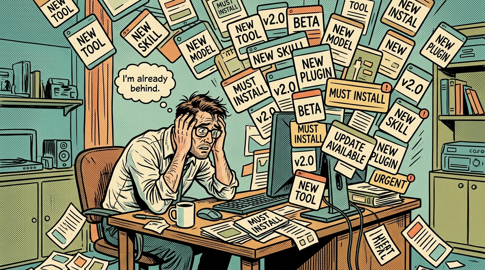
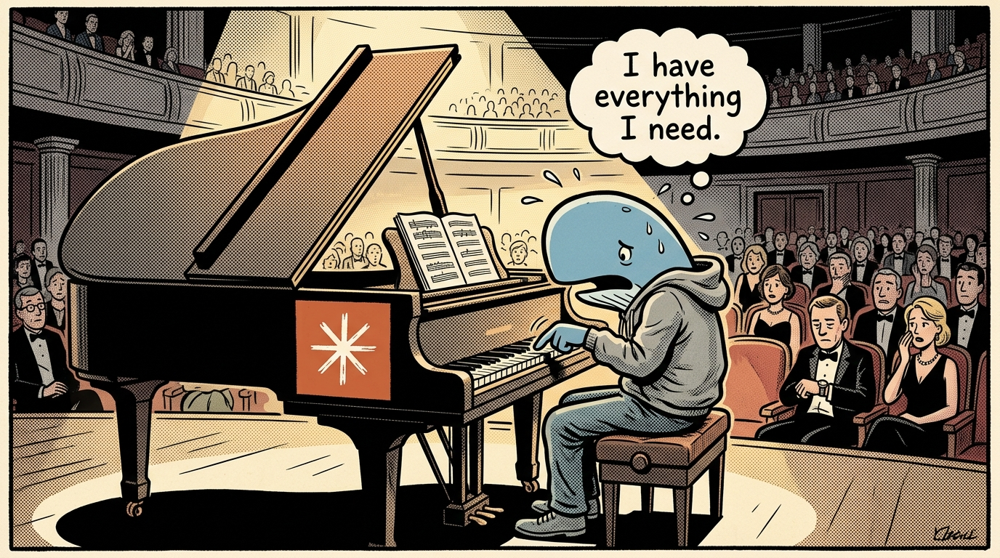
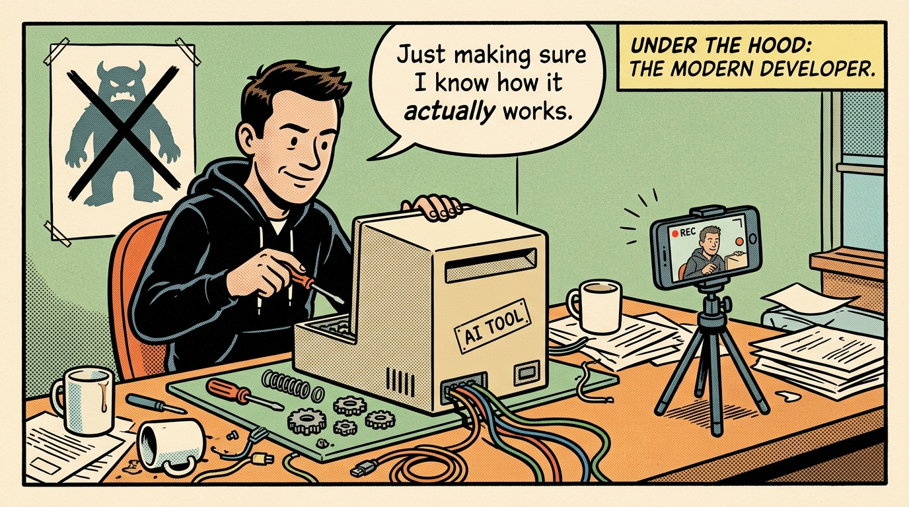

import Tweet from '../../../components/Tweet.astro';
import Comment from '../../../components/Comment.astro';

Depuis mai, dans la foulée de mes trente ans, j'ai pris des vidéos d'influenceurs qui m'intriguaient et je me suis dit : allez, on essaye, face caméra. Une skill qu'il faut absolument installer. Un site construit en trente minutes, avec des animations qui m'auraient pris des jours. Une méthode pour arrêter de payer un modèle frontier et avoir Claude Code gratuitement. Je reproduisais le setup, je filmais la tentative, et je publiais le verdict dans un sens comme dans l'autre.

Soixante fois de suite.

Je n'ai pas commencé pour démonter quoi que ce soit. J'ai commencé parce que je me sentais noyé dans un monde où les nouveautés IA arrivaient beaucoup trop vite. Ça a fini par déclencher une grosse remise en question sur mes capacités professionnelles.

## L'IA va trop vite, il y a trop d'outils

Je n'ai vraiment fait entrer l'IA dans mon process qu'à la fin 2024, début 2025. Avant ça, je m'en servais pour écrire des mails, corriger ma grammaire, ou sortir des petites fonctions. Le code qu'elle produisait à l'époque n'était pas au niveau de qualité qu'exigeait mon client principal, et je perdais du temps à relire du code inutilement compliqué. Il y avait aussi une raison de politique interne : mon client principal, qui monopolise trente-cinq heures de ma semaine, limitait les outils externes. L'IA est donc restée secondaire. Je ne pensais pas qu'elle était assez bonne pour construire une application entière. De la fierté de développeur, surtout : ma capacité à écrire du code de qualité et à être payé pour ça, c'était ce qui avait du sens dans ce métier.

Puis sont arrivés les réseaux sociaux, LinkedIn en premier, avant que le bouton « Ça ressemble à de l'IA slop » n'existe. J'ai vu passer une vague d'« experts IA » qui vantaient les bénéfices d'une skill fraîchement sortie qu'il fallait absolument installer, sans quoi on n'utilisait pas l'IA à pleine puissance. J'ai lu la même histoire encore et encore, à chaque fois pour un plugin, une skill, un outil ou un SaaS IA différent.

Anthropic et OpenAI sortaient un modèle par mois, et des harnais d'agents comme OpenClaw et Hermes apparaissaient. J'ai commencé à perdre le fil. Chaque outil, chaque plugin, chaque skill était meilleur que celui présenté la veille. Le développement web bougeait déjà vite entre 2016 et 2021 avec les librairies et les frameworks JavaScript. Là, c'était plus rapide encore.

Mon premier réflexe a été d'aller voir les créateurs YouTube et le format court sur Instagram et TikTok. Sauf que ces plateformes ont un problème : l'engagement passe avant la qualité du contenu.

- « Regardez ce que Claude a fait en un seul prompt. »
- « J'ai construit un site en 30 minutes, avec des animations qui m'auraient pris plusieurs jours. »
- « Les développeurs vont être remplacés. »
- Des vidéos de vibe coders expliquant comment gagner un million en sept jours en lançant un SaaS. Celle-là mérite son propre article.

Avec mes yeux de novice, c'était terrifiant.

## Sortir de la grotte

Je voulais apprendre. En même temps, je voulais sortir de ma grotte. Pendant six ans j'avais été concentré sur ma carrière et pas beaucoup sur le partage. Aujourd'hui je contribue davantage à l'open source, et le fait d'écrire fait partie du même mouvement, en marquant ma progression à chaque article.

J'ai donc décidé de faire des vidéos pendant que je découvrais les technos IA, en temps réel. La plupart des vidéos courtes sponsorisées que je voyais étaient de la pure démonstration, avec un « commente "Claude" et je t'envoie le lien » à la fin, et jamais la moindre image de la chose réellement testée. Je sais que les réseaux carburent à l'effet waouh. Je regrette que ça ait gagné le développement web, et j'ai un article en cours de rédaction sur le sujet.

Le format court demande aussi moins de temps que le format long, et mon objectif du moment est la régularité. Il me correspond pour une autre raison : il m'a permis de traiter plein de sujets différents, et de rattraper ma dette de connaissance sur l'IA.

Au fil de mes vidéos, j'ai fini par trouver des choses réellement utiles. J'ai découvert un plugin gratuit pour faire du motion design en HTML. J'ai généré des vidéos PowerPoint à partir de mes propres scripts. J'ai trouvé un bon plugin pour rechercher, planifier et implémenter une fonctionnalité. J'ai testé Fable 5 sur une tendance Instagram.

Et je ne suis jamais parvenu, pas une seule fois, à reproduire la promesse du site avec animations au scroll obtenu en dix minutes depuis un prompt.

## Le cas le plus net : on ne copie pas un raisonnement

Une vidéo affirmait qu'on n'avait plus besoin de payer un modèle frontier. Il existe un dépôt GitHub public qui rassemble des dizaines de milliers de lignes de system prompts de Claude, ChatGPT, Cursor et v0. Le pitch : tu copies le prompt, tu le colles dans le modèle le moins cher que tu trouves, et c'est réglé.

Alors j'ai vérifié au lieu de réagir. Rien que le fichier Claude Fable 5 fait environ dix-sept mille mots. Je l'ai passé dans un tokenizer DeepSeek : à peu près vingt-sept mille tokens. Sur un modèle facturé à l'usage, ça coûte quatre centimes. Le pitch avait raison sur le prix, et le prix n'a jamais été le sujet.

Un system prompt, c'est une partition. Le modèle, c'est le musicien. Tu peux photocopier une partition à la perfection et la tendre à quelqu'un qui n'a jamais touché un piano, tu n'auras toujours pas le concert. Ici c'est même pire : les system prompts font constamment référence à des outils fournis par le harnais. Donne ces instructions à un modèle qui n'a pas ces outils, ce qui est exactement la situation de celui qui débarque sur ce dépôt, et les instructions ne pointent vers rien.

Ce que tu as copié, c'est la partition, pas l'orchestre : la boucle d'agent, les outils, la gestion du contexte.

Rien de tout ça ne rend le dépôt inutile. C'est l'une des meilleures écoles de prompt engineering disponibles gratuitement, un vrai regard sur la façon dont des équipes aux moyens sérieux structurent leurs instructions et cadrent leurs outils. Lis-le pour ça. Simplement, pas en te disant que tu as obtenu Claude pour quatre centimes.

J'ai démonté celle-là face caméra. [La vidéo est en français](https://www.instagram.com/reel/DbDCXyvNA5m/?igsh=dGZ5Mnd6czltNTBy), si ça te va.

Les commentaires ont servi à quelque chose, et pas à me féliciter. Celui-ci en particulier.

<Comment author="rayane16e" platform="Instagram" likes={3}>
  Enfin quelqu'un qui dit des choses qui ont du sens. Ça fait 2 sem que je vois
  des vidéos inexactes et pour preuve j'ai toujours fable5.
</Comment>

Il n'avait pas besoin qu'on lui dise que le dépôt était inutile. Il avait besoin que quelqu'un vérifie à sa place ce qu'on lui vendait depuis deux semaines. Et il paie toujours son modèle frontier, ce qui est la seule réponse qui compte à la promesse de la vidéo.

## Ce que soixante tests m'ont appris

Pas que les outils sont mauvais. Plusieurs d'entre eux ont gagné leur place dans ma façon de travailler, et je l'ai dit face caméra à chaque fois.

Ce qui a changé, c'est le ratio auquel je m'attendais. La plus grande partie de ce qui est mis en avant s'est révélée être quelque chose que Claude Code ou ChatGPT font déjà nativement, sans le moindre plugin : repackagé, renommé, et présenté comme une découverte. Une part plus petite ajoutait une vraie capacité nouvelle. Et les promesses totalement irreproductibles étaient, sans exception, celles qui affichaient les plus gros chiffres.

Le créateur de Claude Code l'a écrit lui-même, en janvier 2026, dans un fil qui a dépassé les huit millions de vues.

<Tweet
  url="https://x.com/bcherny/status/2007179832300581177"
  author="Boris Cherny"
  handle="bcherny"
  date="2 janvier 2026 · traduit de l'anglais"
>
  Mon setup est peut-être étonnamment vanilla ! Claude Code marche très bien
  tel quel, donc personnellement je ne le personnalise pas beaucoup.
</Tweet>

Celui qui a construit l'outil ne l'outille presque pas. C'est le meilleur contrepoint que je connaisse à la vidéo qui t'explique qu'il te manque une skill.

J'avais peur, au début, de faire des vidéos techniques expliquant comment une skill fonctionne vraiment, au lieu de montrer un résultat incroyable que je n'aurais su ni produire ni expliquer moi-même. Je ne savais pas s'il existait un public pour ça. Heureux de constater qu'il existe. Quelques personnes m'ont écrit en commentaire et en message pour me remercier d'avoir remis les choses à leur place.

J'ai commencé à publier en mai 2026, au niveau le plus bas, celui du débutant. Je monte depuis vers l'intermédiaire, puis l'avancé. C'est ce démarrage tout en bas qui m'a permis d'apprendre en public sans faire semblant de savoir.

## Ce qui a réellement changé

La surcharge n'a pas disparu parce que j'avais trouvé le bon outil, ni parce que j'avais fini par rattraper mon retard. Elle a disparu parce qu'on ne reste pas intimidé par une chose qu'on a démontée face caméra.

Tester en public force un verdict. Soit ça marche et tu le montres, soit ça ne marche pas et tu le dis. Dans les deux cas la peur est partie avant la fin de l'enregistrement. Soixante fois de suite, et le paysage cesse de paraître infini.

